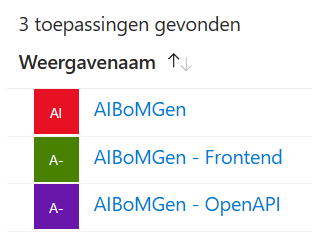

# AIBoMGen Frontend

This is a [Next.js](https://nextjs.org) project bootstrapped with [`create-next-app`](https://nextjs.org/docs/app/api-reference/cli/create-next-app).

---

## Getting Started

### Prerequisites

- **Backend API:** The backend must be running and accessible at the correct URL.
- **Authentication:** The backend **must** have authentication enabled (`AUTH_ENABLED=true`). The frontend will not work without authentication.
- **Azure App Registration:**  
  - You need to register an application in Azure AD for the frontend.
  - This app registration must have delegated permissions to access the backend API (the backend's app registration).
  - Configure the required API permissions in Azure and grant admin consent.


---

### Setup

1. **Install dependencies:**
   ```bash
   npm install
   ```

2. **Create a `.env` file:**
   Copy the `.env.example` file (if available) or create a new `.env` file in the root of the project. Add the following environment variables:

   ```properties
   API_BASE_URL="http://localhost:8000"
   CLIENT_ID="your-frontend-app-client-id"
   REDIRECT_URI="http://localhost:3000"
   POST_LOGOUT_REDIRECT_URI="http://localhost:3000"
   BACKEND_SCOPE="api://<backend-app-id>/user_impersonation"
   ```

   Replace the placeholder values with your actual configuration.

3. **Run the development server:**
   ```bash
   npm run dev
   ```

4. **Build and run in production:**
   ```bash
   npm run build
   npm run start
   ```

5. Open [http://localhost:3000](http://localhost:3000) in your browser.

---

## Authentication

- The frontend uses MSAL (Microsoft Authentication Library) for Azure OAuth authentication.
- Users must sign in with an account that has access to the backend API via the configured Azure App Registrations and permissions.

For the authentication you have to make an extra app registration on Azure on top of the already existing ones for the backend (see [backend authentication](../aibomgen-platform/README.md#oauth-setup))

You should have 3 app registrations: 



The backend and openapi registration can be done using the [FastAPI-Azure-Auth docs](https://intility.github.io/fastapi-azure-auth/b2c/azure_setup)

The frontend registration should have the following settings:
- Redirect URL: http://localhost:3000
- API permissions to the AIBoMGen backend API registration (user_impersonation)
- API permissions to use Microsoft Graph for (email, profile, etc)

---

## Configuration

Configuration is managed via a `.env` file. Below are the required environment variables:

- **API_BASE_URL:** The base URL of your backend API (e.g., `http://localhost:8000`).
- **CLIENT_ID:** The client ID of your frontend Azure App Registration.
- **REDIRECT_URI:** The redirect URI for authentication (e.g., `http://localhost:3000`).
- **POST_LOGOUT_REDIRECT_URI:** The URI to redirect to after logout (e.g., `http://localhost:3000`).
- **BACKEND_SCOPE:** The scope for accessing the backend API (e.g., `api://<backend-app-id>/user_impersonation`).

---

## Learn More

- [Next.js Documentation](https://nextjs.org/docs) - learn about Next.js features and API.
- [Learn Next.js](https://nextjs.org/learn) - an interactive Next.js tutorial.
- [Next.js GitHub repository](https://github.com/vercel/next.js)
- [Next.js deployment documentation](https://nextjs.org/docs/app/building-your-application/deploying)